# SQL

My SQL exercises done so far in PostgreSQL 💻 &#128200;

## Database's relations

## Tasks done by me:

<b> 1. List of products which price is higher than 100. </b>

<b> 2. List of employees sorted by name in ascending order. </b>

<b> 3. List of customer and contact names sorted by customer name. </b>

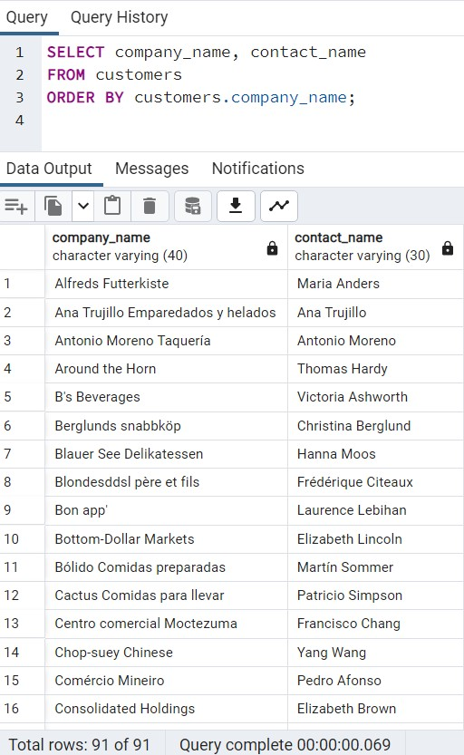

<b> 4. List of employees grouped by country. Fields country and number of people from a given country. </b>

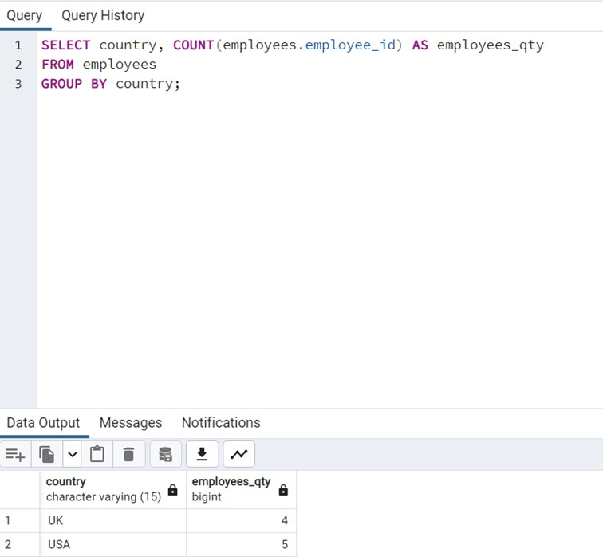

<b> 5. List of orders with the number of items on the order. </b>

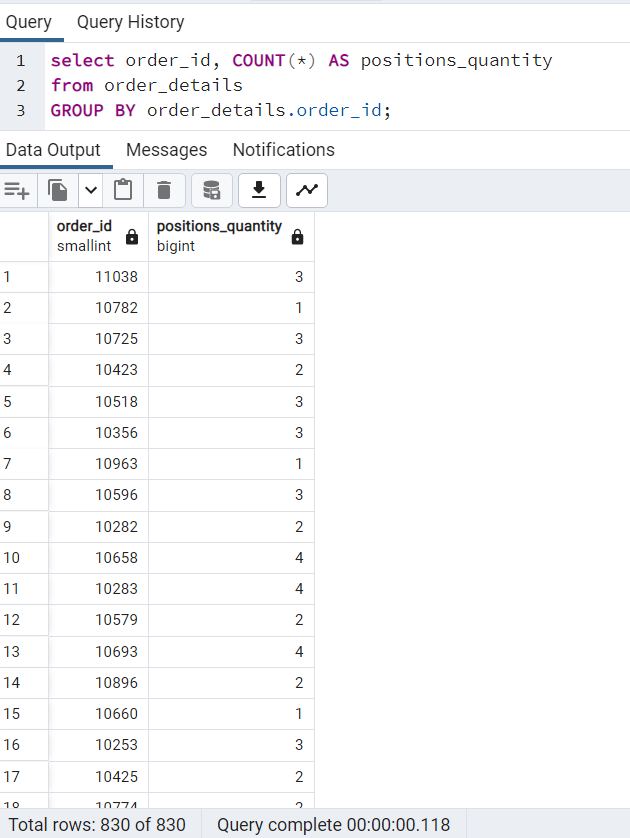

<b> 6. List of the 10 most expensive items from all orders. </b>

<b> 7. From the orders table, display 10 rows from row 2 onwards in order from the most recent date. </b>

<b> 8. Display all products for which there are orders - using EXSISTS or IN </b>

EXISTS

IN

<b> 9. Display the category_name and company_name columns from the suppliers and categories table in one column.</b>

<b> 10. What are the most valuable orders? </b>

Display: order id, company customer, order date, quantity
order items, order amounts, and placing worker
to order. Show rows greater than and equal to 10000, sorted
from the latest date. 

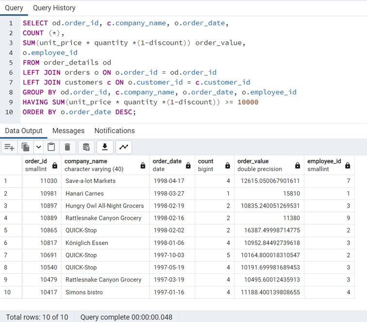

<b> 11. Which of products we sell the most quantity? </b>

Display: product name, supplier name, product quantity in stock, product value in stock, show only current products sorted by the highest value of products on orders. 

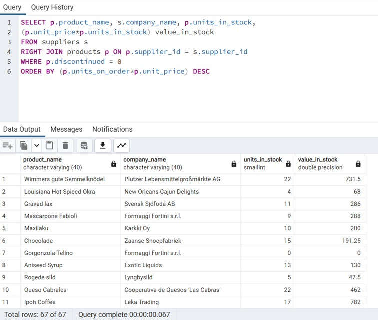

<b> 12. Insert into "us_states" table new data. </b>

state_id = 122,

state_name= podlaskie,

state_region= wschód,

state_abbr= PD; 

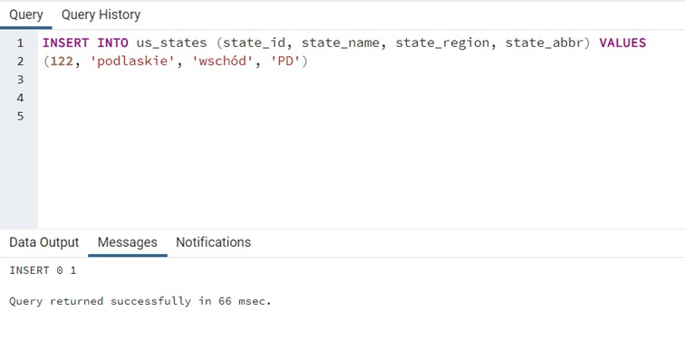

<b> 13. Change state_name from "Alabama" to "Alibaba" in "us_states" table. </b>

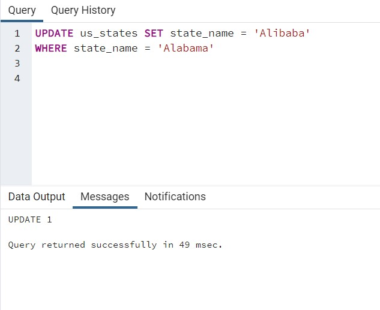

<b> 14. Remove all records with id>100 from "us_states" table. </b>

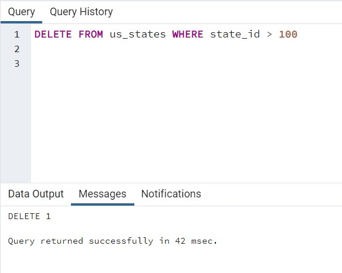

<b> 15. In the us_states table, change all state_abbr values ​​to uppercase. </b>

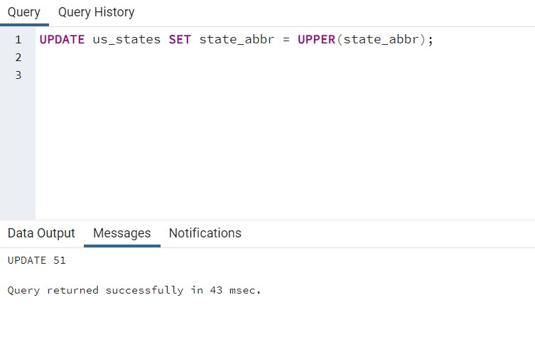

<b> 16. Remove from us_states table all records started with "w" letter. </b>

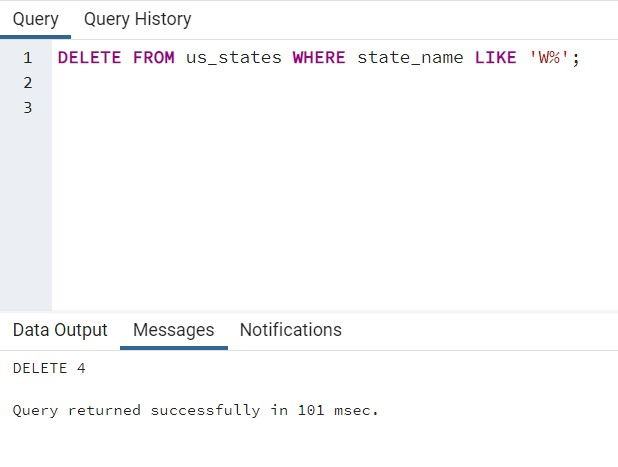
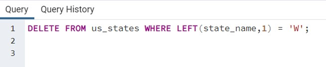
