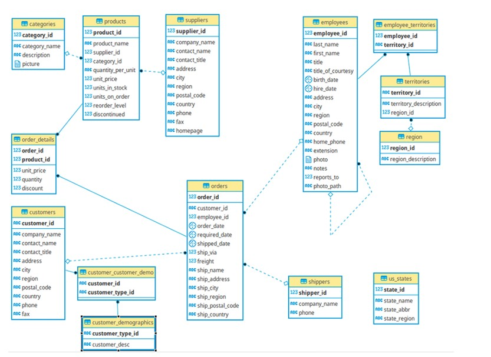
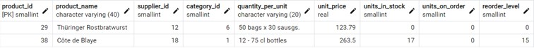
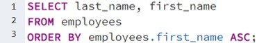
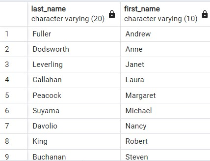
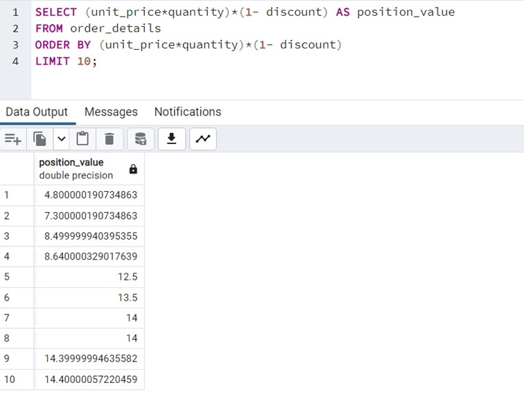
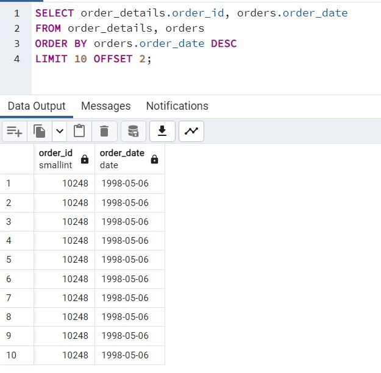
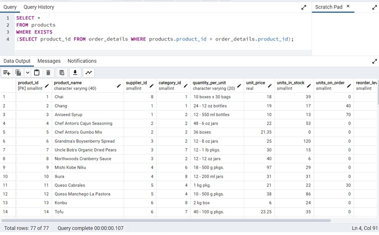
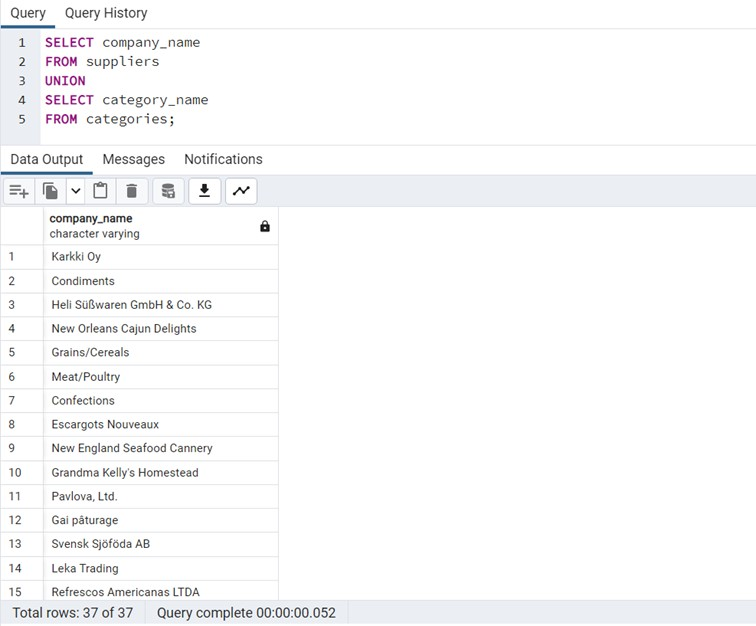

# SQL

My excercises from northwind database

## Database's relations

<b> 1. List of products which price is higher than 100. </b>

<b> 2. List of employees sorted by name in ascending order. </b>

<b> 3. List of customer and contact names sorted by customer name. </b>

<b> 4. List of employees grouped by country. Fields country and number of people from a given country. </b>

<b> 5. Lista zamówień z ilością pozycji na zamówieniu. </b>

<b> 6. List of the 10 most expensive items from all orders. </b>

<b> 7. From the orders table, display 10 rows from row 2 onwards in order from the most recent date. </b>

<b> 8. Display all products for which there are orders - using EXSISTS or IN </b>

EXISTS

IN

<b> 9. Display the category_name and company_name columns from the suppliers and categories table in one column.</b>

